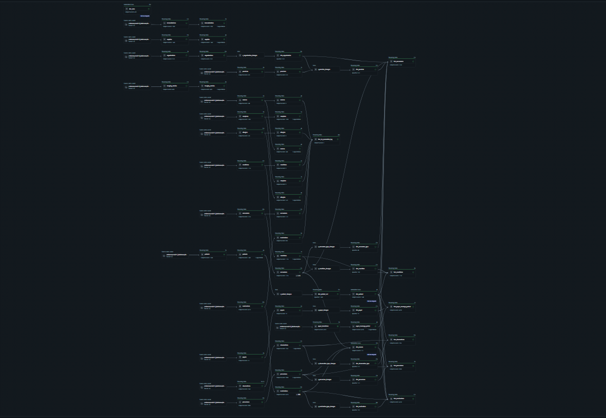
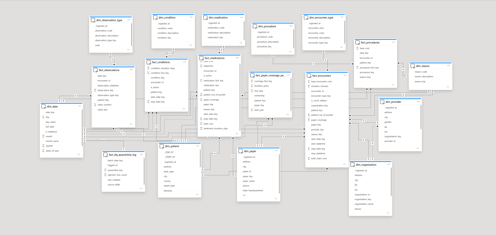
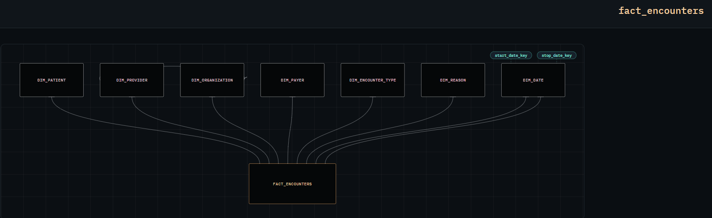
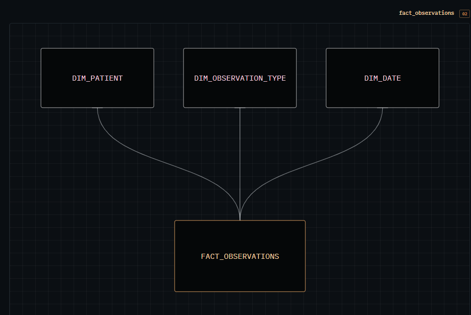
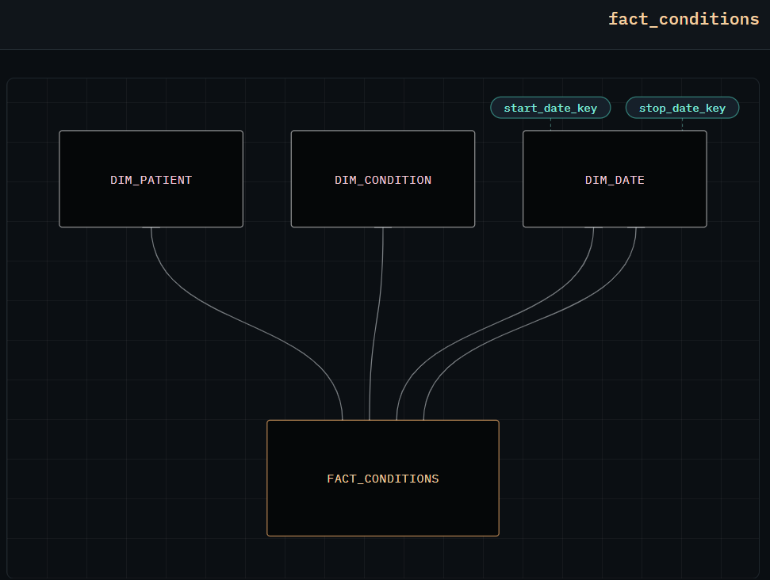
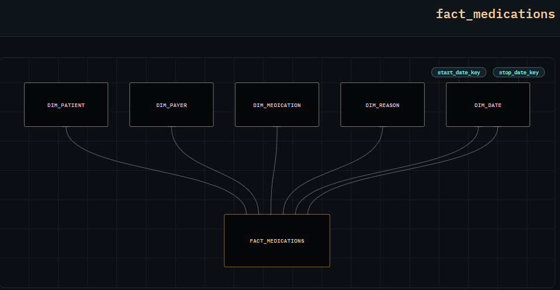
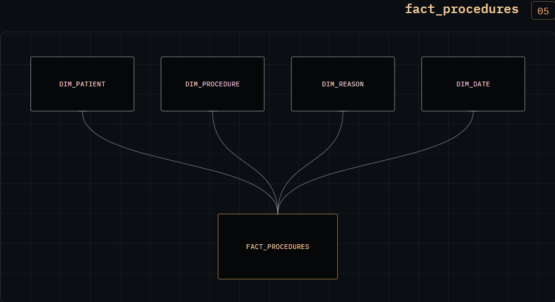
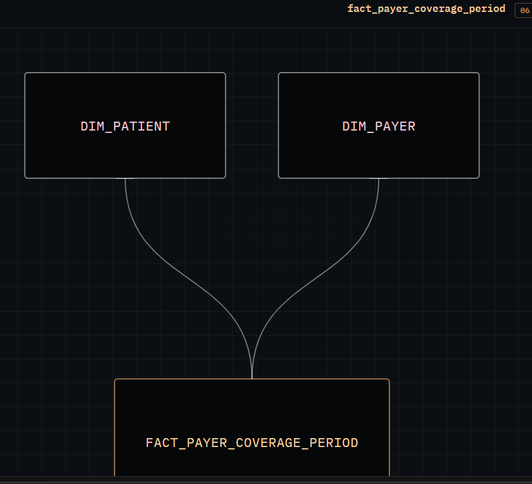
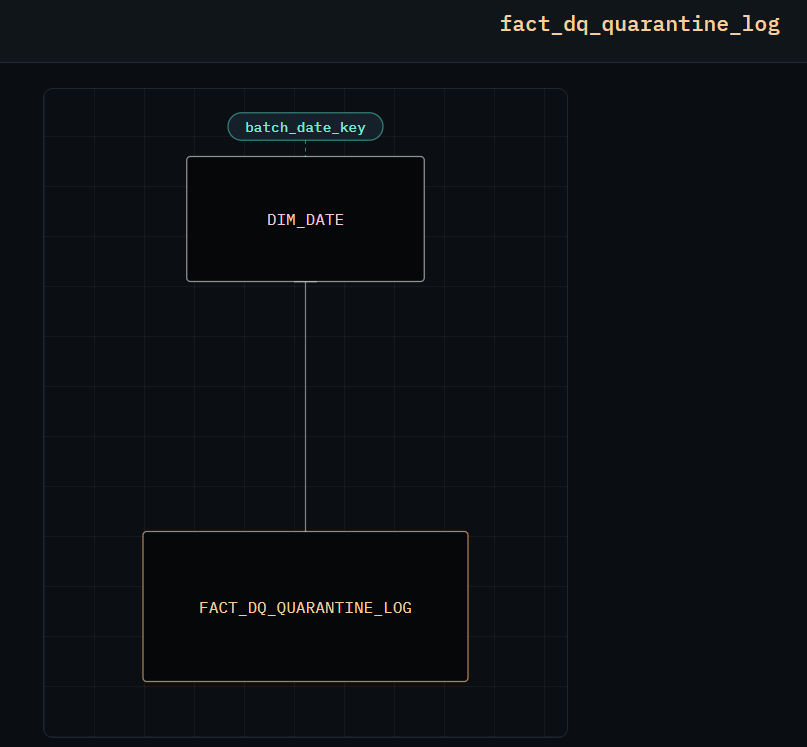

<div align="center">

# Healthcare Clinical Data Lakehouse Architecture

### An End-to-End Medallion Data Lakehouse on Databricks with AI-Powered Analytics

[](https://www.databricks.com/)
[](https://spark.apache.org/)
[](https://delta.io/)
[](https://www.databricks.com/product/delta-live-tables)
[](https://www.databricks.com/product/databricks-genie)

[]()
[]()
[]()
[]()
[]()

</div>

---

## Overview

The **Healthcare Clinical Data Lakehouse** is a production-grade, end-to-end data engineering and analytics platform built on the Databricks Lakehouse architecture. It ingests synthetic clinical data from the [Synthea 100K Patients](https://synthea.mitre.org/) dataset (16 CSV source tables, 100K+ patients) and transforms it through a structured **Medallion architecture** (Bronze → Silver → Gold) into a **Kimball Star Schema** optimized for clinical, operational, and financial analytics.

The project leverages **Delta Live Tables (DLT)** for declarative pipeline orchestration with built-in data quality enforcement, quarantine tracking, and incremental processing via Auto Loader. The Gold layer delivers **18 analytical tables** (11 dimensions + 7 facts) with performance optimizations including **Liquid Clustering**, **Change Data Feed**, **Deletion Vectors**, and **ZSTD compression**.

A semantic layer of **5 Databricks Metric Views** powers both a **Databricks Genie AI** data room for natural-language Q&A and a multi-page **Power BI dashboard** for executive reporting across clinical, operational, financial, demographic, and data-quality dimensions.

### Key Metrics at a Glance

| Metric | Value |
| --- | --- |
| Source Tables | 16 CSV files (Synthea 100K) |
| Gold Layer Tables | 18 (11 Dimensions + 7 Facts) |
| Total Fact Rows | ~26.2 Million |
| Total Dimension Rows | ~246K |
| Metric Views (Semantic Layer) | 5 |
| Primary Keys | 19 |
| Foreign Key Relationships | 27 |
| DLT Data Quality Rules | 20+ expectations across Silver/Gold |
| Liquid Clustering Speedup | Up to 47.2% on `fact_observations` |

---

## Architecture Diagram

<div align="center">



*Medallion Architecture — DLT Pipeline Data Lineage DAG (Bronze → Silver → Gold → Semantic Layer)*

</div>

```
┌─────────────────────────────────────────────────────────────────────────────┐
│                        SYNTHESIZER (16 CSV Files)                            │
│  patients · encounters · observations · conditions · medications · procedures │
│  organizations · providers · payers · claims · imaging · devices · ...       │
└──────────────────────────────┬──────────────────────────────────────────────┘
                               │
                    ┌──────────▼──────────┐
                    │   AUTO LOADER       │
                    │   (Incremental)     │
                    └──────────┬──────────┘
                               │
          ┌────────────────────▼─────────────────────┐
          │              BRONZE LAYER                  │
          │  • 1 DLT Notebook (Auto Loader loop)      │
          │  • 16 Streaming Tables                     │
          │  • All columns as STRING (Raw Truth)      │
          │  • Schema evolution: rescue               │
          └────────────────────┬─────────────────────┘
                               │
          ┌────────────────────▼─────────────────────┐
          │              SILVER LAYER                 │
          │  • 16 DLT Notebooks (1 per source)        │
          │  • Type Casting (DATE, DECIMAL, etc.)     │
          │  • DQ Rules: @dlt.expect / expect_or_drop  │
          │  • Quarantine tables for rejected rows    │
          │  • Standardized text (M→male, S→single)   │
          └────────────────────┬─────────────────────┘
                               │
          ┌────────────────────▼─────────────────────┐
          │               GOLD LAYER                   │
          │  • 18 Tables (11 Dims + 7 Facts)           │
          │  • Kimball Star Schema                     │
          │  • SCD Type 2 (dim_patient)                 │
          │  • Surrogate Keys (xxhash64)               │
          │  • Unknown Member pattern (-1)             │
          │  • Liquid Clustering (3 fact tables)       │
          │  • 5 Metric Views (Semantic Layer)         │
          └────────────────────┬─────────────────────┘
                               │
              ┌────────────────┼────────────────┐
              │                │                │
    ┌─────────▼────────┐  ┌───▼────────┐  ┌───▼──────────────┐
    │  GENIE AI        │  │ Dashboard    │  │  DQ MONITORING   │
    │  Data Room       │  │ (5 Pages)  │  │  Quarantine Log  │
    │  (NL Q&A)        │  │            │  │  fact_dq_quar_log │
    └──────────────────┘  └────────────┘  └──────────────────┘
```

---

## Tech Stack

| Category | Technology | Role |
| --- | --- | --- |
| **Cloud Platform** | Databricks on AWS | Unified Lakehouse compute & storage |
| **Data Orchestration** | Delta Live Tables (DLT) | Declarative pipeline management with DQ expectations |
| **Data Ingestion** | Auto Loader | Incremental file ingestion with schema evolution |
| **Processing Engine** | Apache Spark / PySpark | Distributed data transformations |
| **Storage Format** | Delta Lake | ACID transactions, CDF, Liquid Clustering, Row Tracking |
| **Data Modeling** | Kimball Star Schema | Dimensional modeling with surrogate keys & SCD2 |
| **Catalog** | Unity Catalog | Centralized governance, access control, metadata |
| **AI / NL Q&A** | Databricks Genie AI | Natural language data exploration over metric views |
| **BI Visualization** | Databricks Dashboard | Executive dashboards & interactive analytics |
| **Optimization** | Liquid Clustering + Z-Ordering | Query acceleration on large fact tables |
| **Data Quality** | DLT Expectations + Quarantine | Automated DQ enforcement with audit trail |
| **Dataset** | Synthea 100K Patients | Synthetic clinical data (16 CSV tables) |

---

## Key Features

### 1. Medallion Lakehouse Architecture

- **Bronze (Raw Ingestion):** A single DLT notebook with an Auto Loader loop ingests all 16 CSV source tables as Delta streaming tables. All columns are preserved as `STRING` types — the "Raw Truth" principle. Schema evolution handles unexpected columns via rescue mode.
- **Silver (Cleansed & Conformed):** 16 dedicated DLT notebooks (one per source table) perform type casting (`DATE`, `DECIMAL`, `DOUBLE`, `INT`, `BOOLEAN`), text standardization (e.g., `M` → `male`, `S` → `single`), and data quality enforcement via `@dlt.expect` and `@dlt.expect_or_drop` decorators. Rejected rows are routed to quarantine tables for 6 critical source tables.
- **Gold (Analytics-Ready):** 18 analytical tables organized as a Kimball Star Schema. Dimensions use surrogate keys (`xxhash64`), the patient dimension supports SCD Type 2 for historical tracking, and fact tables are anchored by `fact_encounters` as the central hub.

### 2. Automated Data Pipelines with DLT

- **Declarative Orchestration:** All 35 notebooks are orchestrated by a single Lakeflow Spark Declarative Pipeline (SDP) with automatic dependency resolution.
- **Data Quality Expectations:** 20+ DQ rules across Silver and Gold layers validate referential integrity, temporal logic (e.g., `death_date >= birth_date`), cost non-negativity, and cross-table key consistency.
- **Quarantine Tracking:** Rejected records are counted and logged to `fact_dq_quarantine_log` — a governance fact table providing an auditable trail of every DQ violation per source table, per rule, per batch.
- **Incremental Processing:** Auto Loader enables near-real-time ingestion of new CSV files as they arrive in cloud storage.

### 3. Galaxy Schema Data Modeling (Kimball)

- **9 Dimension Tables:** Including `dim_patient` with **SCD Type 2** (preserving all historical patient profile versions via `__START_AT` / `__END_AT` / `is_current` columns), conformed dimensions (`dim_payer`, `dim_reason`, `dim_date`), and a snowflake relationship (`dim_provider` → `dim_organization`).
- **6 Fact Tables:** Anchored by `fact_encounters` (3.1M rows) as the central hub. Child facts (`fact_observations` at 16.2M rows, `fact_conditions`, `fact_medications`, `fact_procedures`) connect back via the `encounter_id` degenerate dimension.
- **1 Governance Fact Table:** `fact_dq_quarantine_log` tracks data quality rejections across the pipeline.
- **Design Patterns:** Surrogate keys (`xxhash64`), Unknown Member pattern (`-1` for NULL FKs), role-playing date dimension, bridge table for comorbidity analysis.

### 4. Performance Optimization

- **Liquid Clustering:** Applied to the 3 largest fact tables using the most common query filter columns:
  - `fact_observations` → `CLUSTER BY (patient_key, date_key)` — **47.2% query speedup**
  - `fact_medications` → `CLUSTER BY (patient_key, start_date_key)` — **28.4% speedup**
  - `fact_encounters` → `CLUSTER BY (patient_key, start_date_key)` — **17.5% speedup**
- **Z-Ordering:** Complementary layout optimization for ad-hoc analytical queries on dimension columns.
- **Delta Lake Features (all Gold tables):** Change Data Feed, Deletion Vectors, Row Tracking, ZSTD compression, V2 checkpoints.
- **Predictive Optimization:** Auto-running `OPTIMIZE` and `VACUUM` on all Gold tables.

### 5. Semantic Layer & AI Integration

- **5 Databricks Metric Views:** Pre-aggregated KPI views (`fact_encounters_metric_view`, `fact_conditions_metric_view`, `fact_medications_metric_view`, `fact_observations_metric_view`, `fact_procedures_metric_view`) providing ready-to-query metrics for cost, duration, prevalence, and demographic breakdowns.
- **Databricks Genie AI:** A Genie data room configured over the metric views enables natural-language clinical and operational Q&A (e.g., "What is the average encounter cost for COVID-related visits by month?").
- **Column Comments:** 135 column-level comments across all 18 Gold tables provide business context for Genie AI and dashboard consumers.

---

## Data Model (Galaxy Schema)

<div align="center">



*Kimball Galaxy Schema — 11 Dimensions + 7 Facts anchored by `fact_encounters`*

</div>

### Dimension Tables (9)

| Dimension | Primary Key | Grain | Rows | Description |
| --- | --- | --- | --- | --- |
| `dim_patient` | `patient_key` | One row per patient **version** (SCD2) | 124,150 | Patient demographics with historical tracking |
| `dim_date` | `date_key` | One row per calendar date (1909–2020) | 40,908 | Conformed calendar dimension |
| `dim_condition` | `condition_key` | One row per unique condition | 189 | SNOMED-CT diagnosis lookup |
| `dim_encounter_type` | `encounter_type_key` | One row per visit classification | 48 | Ambulatory, emergency, inpatient, etc. |
| `dim_medication` | `medication_key` | One row per unique medication | 181 | RxNorm medication lookup |
| `dim_observation_type` | `observation_type_key` | One row per observation type | 215 | Clinical measurement type + units |
| `dim_organization` | `organization_key` | One row per healthcare facility | 9,175 | Hospital/facility with geo-coordinates |
| `dim_payer` | `payer_key` | One row per insurance provider | 10 | Conformed payer dimension |
| `dim_procedure` | `procedure_key` | One row per unique procedure | 177 | SNOMED-CT procedure lookup |
| `dim_provider` | `provider_key` | One row per physician | 60,534 | Provider with specialty + org FK (snowflake) |
| `dim_reason` | `reason_key` | One row per reason + Unknown Member (-1) | 123 | Conformed reason from 3 source tables |

> *Plus `dim_date` and `dim_reason` as conformed/auxiliary dimensions, and `dim_patient_scd` as the internal SCD2 backing table.*

### Fact Tables (6)

| Fact Table | Primary Key | Grain | Rows | Key Measures |
| --- | --- | --- | --- | --- |
| `fact_encounters` | `encounter_id` | One row per healthcare encounter | 3,183,531 | `total_claim_cost`, `payer_coverage`, `duration_minutes`, `is_covid_related` |
| `fact_observations` | `observation_key` | One row per clinical observation | 16,219,969 | `value_numeric`, `value_text` |
| `fact_conditions` | `condition_fact_key` | One row per condition diagnosis | 1,143,900 | `condition_duration_days`, `is_active` (Factless/Bridge) |
| `fact_medications` | `medication_fact_key` | One row per prescription | 4,226,915 | `total_cost`, `payer_coverage`, `treatment_duration_days` |
| `fact_procedures` | `procedure_fact_key` | One row per procedure | 979,564 | `base_cost` |
| `fact_payer_coverage_period` | `coverage_fact_key` | One row per patient–payer period | 409,553 | `duration_years`, `ownership` |

### Fact Table Previews

<div align="center">

<table>
  <tr>
    <td align="center"><br><sub><code>fact_encounters</code> (3.1M rows)</sub></td>
    <td align="center"><br><sub><code>fact_observations</code> (16.2M rows)</sub></td>
  </tr>
  <tr>
    <td align="center"><br><sub><code>fact_conditions</code> (1.1M rows)</sub></td>
    <td align="center"><br><sub><code>fact_medications</code> (4.2M rows)</sub></td>
  </tr>
  <tr>
    <td align="center"><br><sub><code>fact_procedures</code> (979K rows)</sub></td>
    <td align="center"><br><sub><code>fact_payer_coverage_period</code> (409K rows)</sub></td>
  </tr>
  <tr>
    <td align="center" colspan="2"><br><sub><code>fact_dq_quarantine_log</code> — DQ Governance Fact</sub></td>
  </tr>
</table>

</div>

### Governance Table (1)

| Table | Primary Key | Grain | Description |
| --- | --- | --- | --- |
| `fact_dq_quarantine_log` | `quarantine_key` | One row per DQ rejection event per batch | Logs rejected records per source table, per violated rule, per streaming batch |

### Entity Relationship Summary

```
                          dim_encounter_type
                                │
                         fact_encounters ──────── dim_reason (conformed)
                    /    │    │      │    \         │          \
        dim_patient  dim_provider  dim_organization  dim_payer  dim_date (role-playing)
           │  \           │  \         │               │  \        │
           │   \          │   \        │               │   \       │
     fact_obs  fact_cond  │  fact_med  │          fact_proc  fact_pcp
           │     │        │     │      │               │         │
           └─────┴────────┘     └──────┘               └─────────┘
              (all join back to fact_encounters via encounter_id degenerate dimension)

  dim_provider ──(snowflake FK)──→ dim_organization
  dim_reason (-1 Unknown Member) ──→ fact_encounters, fact_medications, fact_procedures
  dim_date ──(role-playing)──→ start_date_key & stop_date_key on multiple facts
```

---

## Delta Live Tables (DLT) & Data Quality

### Pipeline Architecture

The entire Medallion pipeline is orchestrated by a single **Lakeflow Spark Declarative Pipeline (SDP)** that manages Bronze ingestion, Silver transformation, and Gold dimensional modeling as a connected DAG.

```
┌──────────────────────────────────────────────────────┐
│          DLT PIPELINE (Single SDP DAG)                │
│                                                      │
│  BRONZE (1 notebook)                                 │
│  ├── Auto Loader loop over 16 CSV files              │
│  └── Streaming Tables (all STRING columns)           │
│                                                      │
│  SILVER (16 notebooks)                               │
│  ├── Type casting + text standardization             │
│  ├── @dlt.expect  (warn on violation)                │
│  ├── @dlt.expect_or_drop (quarantine on violation)    │
│  └── 6 quarantine tables                             │
│                                                      │
│  GOLD (18 notebooks)                                 │
│  ├── 11 Dimension tables (SCD1 + SCD2)               │
│  ├── 7 Fact tables (surrogate keys, bridge, etc.)    │
│  ├── dlt.apply_changes (dim_patient SCD2)            │
│  └── fact_dq_quarantine_log (governance)             │
│                                                      │
│  SEMANTIC LAYER (5 Metric Views)                     │
│  └── Pre-aggregated KPIs for Genie AI & Power BI     │
└──────────────────────────────────────────────────────┘
```

### Data Quality Framework

| Layer | DQ Mechanism | Example Rules | Action |
| --- | --- | --- | --- |
| Silver | `@dlt.expect` | `death_date IS NULL OR death_date >= birth_date` | Warn (keep row) |
| Silver | `@dlt.expect_or_drop` | `total_cost >= 0`, `stop_date >= start_date` | Drop + quarantine |
| Gold | `@dlt.expect` | `payer_coverage <= total_claim_cost` | Warn (keep row) |
| Gold | DLT apply_changes | SCD2 sequence via `_ingested_at` | Auto-resolve versions |

### Quarantine Governance

Rejected records from 6 critical Silver tables are aggregated into `fact_dq_quarantine_log`:

| Column | Type | Description |
| --- | --- | --- |
| `quarantine_key` | BIGINT | Surrogate PK |
| `source_table` | STRING | Which Silver table the rejection occurred in |
| `rule_violated` | STRING | DQ rule description (e.g., `STOP < START`) |
| `rejected_row_count` | BIGINT | Number of rejected records in this batch |
| `batch_date_key` | INT | FK → `dim_date.date_key` |
| `logged_at` | TIMESTAMP | When the quarantine metric was computed |

**Recorded DQ violations:** 5,144 encounters + 808 medications rejected during Silver processing.

---

## GenAI (Genie) Integration

Databricks Genie AI is configured as a **Genie data room** over the 5 Metric Views in the Gold layer, enabling natural-language data exploration for clinical and operational decision-making.

### How It Works

```
┌───────────────────────┐     ┌──────────────────────┐     ┌─────────────────────┐
│  Natural Language Q   │────▶│  Genie AI Data Room   │────▶│  Metric Views (SQL) │
│  (User asks a question)│     │  (LLM translates NL   │     │  (Pre-aggregated     │
│                       │◀────│   to SQL queries)     │◀────│   Gold layer KPIs)  │
└───────────────────────┘     └──────────────────────┘     └─────────────────────┘
```

### Metric Views Available to Genie

| Metric View | KPIs Exposed |
| --- | --- |
| `fact_encounters_metric_view` | Encounter count, total claim cost, avg duration, patient out-of-pocket, COVID flag breakdowns |
| `fact_conditions_metric_view` | Condition prevalence, active/resolved counts, avg duration, distinct patients per condition |
| `fact_medications_metric_view` | Prescription count, total/avg medication cost, payer coverage, treatment duration patterns |
| `fact_observations_metric_view` | Observation count, avg/min/max numeric values, positive test count, distinct patients observed |
| `fact_procedures_metric_view` | Procedure count, total/avg cost, distinct patients per procedure |

### Example Genie Queries

> "What is the average encounter cost for COVID-related visits by month?"
>
> "Which medications have the highest out-of-pocket cost for patients?"
>
> "What are the top 10 most prevalent chronic conditions by patient county?"
>
> "How has the positive COVID test rate changed over time?"

### Column-Level Context for Genie

135 column-level comments across all 18 Gold tables provide Genie AI with the business context needed to generate accurate SQL — covering column semantics, SCD2 behavior, degenerate dimensions, and geographic granularity notes.

---

## Dashboards & Analytics (Databricks)

The dashboard delivers 5 pages of interactive clinical, operational, and financial analytics:

| Dashboard Page | Focus Area | Key Visuals |
| --- | --- | --- |
| **Clinical & Epidemiological** | COVID-19 clinical outcomes | Condition prevalence, observation trends, COVID test positivity rate |
| **COVID-19 Patient Profile & Clinical Deep-Dive** | Deep-dive into COVID patient journeys | Patient profile, condition timeline, medication history, observation trends |
| **Operational Analysis** | Patient flow and facility utilization | Encounter volume by type/org, duration analysis, provider workload |
| **Financial Analysis** | Cost and insurance breakdown | Claim cost → payer coverage → patient out-of-pocket waterfall, medication costs |
| **Patient Demographics** | Patient population analysis | Age/gender/race/ethnicity breakdowns, geographic distribution (county-level) |

### Dashboard Screenshots

<div align="center">


*Clinical & Epidemiological — Condition prevalence, observation trends, and COVID test positivity*

---


*COVID-19 Patient Profile & Clinical Deep-Dive — Patient journey, condition timeline, and medication history*

---


*Operational Analysis — Encounter volume, facility utilization, and provider workload*

---


*Financial Analysis — Claim cost decomposition, payer coverage, and patient out-of-pocket*

---


*Patient Demographics — Age, gender, race, ethnicity, and geographic distribution*

</div>

---

## Repository Structure

```
covid19_databricks_project/
├── 00_setup/
│   └── create_catalog_schemas          # Unity Catalog + schema initialization
│
├── 01_eda_profiling/
│   └── _eda_profiling                  # Exploratory data analysis (nulls, distinct, ranges, RI)
│
├── covid19_medallion_pipeline/
│   ├── bronze/
│   │   └── 01_bronze_autoloader_dlt     # Auto Loader loop over 16 CSV files → Bronze streaming tables
│   │
│   ├── silver/                         # 16 Silver notebooks (1 per source table)
│   │   ├── 01 silver patients          #   Type casting + DQ + text standardization
│   │   ├── 02 silver encounters
│   │   ├── 03 silver observations
│   │   ├── 04 silver conditions
│   │   ├── 05 silver medications
│   │   ├── 06 silver procedures
│   │   ├── 07 silver organizations
│   │   ├── 08 silver providers
│   │   ├── 09 silver payers
│   │   ├── 10 silver payer coverage period
│   │   ├── 11 silver careplans
│   │   ├── 12 silver allergies
│   │   ├── 13 silver devices
│   │   ├── 14 silver imaging studies
│   │   ├── 15 silver immunizations
│   │   └── 16 silver supplies
│   │
│   └── gold/                           # 18 Gold notebooks (11 Dims + 7 Facts)
│       ├── 00 dim date                 #   Conformed calendar dimension (MV)
│       ├── 01 dim condition             #   SNOMED-CT condition lookup
│       ├── 02 dim procedure             #   Procedure lookup
│       ├── 03 dim organization          #   Healthcare facility
│       ├── 04 dim provider               #   Physician (snowflake → org)
│       ├── 05 dim payer                  #   Insurance provider (conformed)
│       ├── 06 dim encounter type         #   Visit classification
│       ├── 07 dim reason                 #   Conformed reason + Unknown Member (-1)
│       ├── 08 dim patient               #   SCD Type 2 via dlt.apply_changes
│       ├── 09 dim observation type      #   Observation/measurement type
│       ├── 10 dim medication            #   Medication lookup
│       ├── fact encounters              #   Hub fact (3.1M rows, clustered)
│       ├── fact observations            #   Largest fact (16.2M rows, clustered)
│       ├── fact conditions               #   Factless/bridge (1.1M rows)
│       ├── fact medications             #   Prescription fact (4.2M rows, clustered)
│       ├── fact procedures              #   Procedure fact (979K rows)
│       ├── fact payer coverage period   #   Coverage fact (409K rows)
│       └── fact dq quarantine log       #   DQ governance fact
│
├── analytics/
│   └── 02_column_comments_notebook      # Column-level comments (135 cols / 18 tables)
│
├── optimazion/
│   ├── 01_liquid_clustering_benchmark   # Liquid Clustering benchmark (before/after speedups)
│   └── 02_executive_summary_visual_proofs # 5 visual proof artifacts
│
├── Data Architecture Documentation      # Logical + Physical data model documentation
├── docs/                               # Project screenshots & diagrams
│   ├── data_lineage_dag.png             #   DLT pipeline lineage DAG
│   ├── healthcare_data_model.png        #   Star schema ERD diagram
│   ├── Clinical & Epidemiological.png   #   Dashboard: Clinical page
│   ├── COVID-19 Patient Profile & Clinical Deep-Dive.png
│   ├── Operational Analysis.png         #   Dashboard: Operational page
│   ├── Financial Analysis.png           #   Dashboard: Financial page
│   ├── Patient Demographics.png         #   Dashboard: Demographics page
│   ├── fact_encounters.png              #   Table preview
│   ├── fact_observations.png            #   Table preview
│   ├── fact_conditions.png             #   Table preview
│   ├── fact_medications.png             #   Table preview
│   ├── fact_procedures.png              #   Table preview
│   ├── fact_payer_coverage_period.png   #   Table preview
│   └── fact_dq_quarantine_log.png       #   Table preview
└── COVID-19 Healthcare Analytics.lvdash.json  # Lakeview dashboard definition
```

---


## Delta Lake Physical Configuration

All 18 Gold tables share the following Delta Lake configurations (managed by the SDP pipeline):

| Delta Feature | Property | Value |
| --- | --- | --- |
| Change Data Feed | `delta.enableChangeDataFeed` | `true` |
| Deletion Vectors | `delta.enableDeletionVectors` | `true` |
| Row Tracking | `delta.enableRowTracking` | `true` |
| Compression | `delta.parquet.compression.codec` | `zstd` |
| Min Reader Version | `delta.minReaderVersion` | `3` |
| Min Writer Version | `delta.minWriterVersion` | `7` |
| V2 Checkpoints | `delta.checkpointPolicy` | `v2` |
| Predictive Optimization | — | `ENABLE` |

### Liquid Clustering Details

| Table | Clustering Keys | Speedup |
| --- | --- | --- |
| `fact_observations` | `CLUSTER BY (patient_key, date_key)` | 47.2% |
| `fact_medications` | `CLUSTER BY (patient_key, start_date_key)` | 28.4% |
| `fact_encounters` | `CLUSTER BY (patient_key, start_date_key)` | 17.5% |

### SCD Type 2 Configuration (`dim_patient`)

| Property | Value |
| --- | --- |
| Implementation | `dlt.apply_changes()` in the SDP pipeline |
| Backing Table | `dim_patient_scd` (STREAMING_TABLE) |
| Exposed View | `dim_patient` (MATERIALIZED_VIEW with `is_current` derived column) |
| Sequence Key | `_ingested_at` (TIMESTAMP) |
| SCD2 Columns | `__START_AT`, `__END_AT` (NULL = current version) |
| Derived Column | `is_current` = `__END_AT IS NULL` |

---

## Performance Benchmarks

Liquid Clustering benchmarks were measured by running representative analytical queries before and after clustering:

| Fact Table | Rows | Before (s) | After (s) | Speedup |
| --- | --- | --- | --- | --- |
| `fact_observations` | 16,219,969 | 1.621 | 0.857 | **47.2%** |
| `fact_medications` | 4,226,915 | 1.092 | 0.782 | **28.4%** |
| `fact_encounters` | 3,183,531 | 0.765 | 0.632 | **17.5%** |

> Run `optimazion/01_liquid_clustering_benchmark` for full benchmark details.

---

## Acknowledgments

- **Dataset:** [Synthea Patient Generator](https://synthea.mitre.org/) by MITRE — synthetic patient records for open-source healthcare analytics
- **Platform:** [Databricks Lakehouse](https://www.databricks.com/) — unified data, analytics, and AI platform
- **Modeling:** [Kimball Group](https://www.kimballgroup.com/) — dimensional modeling methodology

---


## 👤 Author

**Ahmed Nabil** — Data Engineer
[LinkedIn](https://www.linkedin.com/in/ahmed-nabil33) · [GitHub](https://github.com/Ahmed-Nabil-2002)
</div>